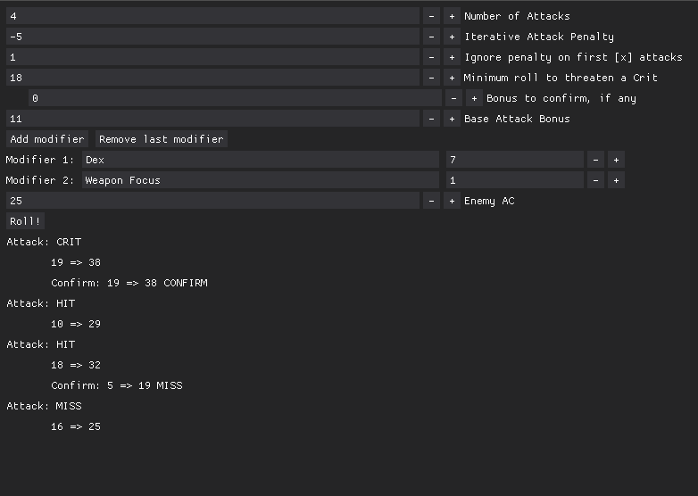

# Pathfinder Simple Iterative Attack Calculator
Fairly straightforward, if you're used to how pathfinder iterative attacks work.

- At each Base Attack Bonus (BAB) progression that is 1+a multiple of 5, you gain another attack to use in a full-round attack action.
- Abilities such as the Monk's Flurry of Blows class feature, the Haste spell, or the Speed weapon property allow you an additional attack at full BAB.

This tool is a very very simple UI for generating a series of simple iterative attacks. It's mostly for personal use but feel free to yell at me to add something, I guess.

## Usage

Python 3.9+
> python3 pathfinder-simple-iterative-attack-calc.py

Simple explanation of the fields:

| Label | Description |
| :-: | --- | 
| Number of Attacks | Total number of attacks to make |
| Iterative Attack Penalty| Typically, iterative attacks are made at cumulative -5s. There are some abilities, like the 7th level Shattered Moon maneuver Infinite Reflections, that let you perform iterative attacks at a reduced penalty. |
| Ignore penalty on first [x] attacks | Abilities such as Haste that grant an extra attack at your highest BAB ignore the iterative attack penalty. |
| Minimum roll to threaten a Crit | Minimum number that you need, on dice, to threaten a critical hit. |
| Bonus to confirm, if any | Any bonuses to confirm critical hits, as from the Critical Focus feat or similar. |
| Base Attack Bonus | BAB. |
| Modifiers | Any number of different modifiers to the attack roll, if you wanna keep track of what sources you're getting buffs from. |
| Enemy AC | AC to attempt to hit. If you don't know the AC, set it to 0 and report the total roll to your DM. |

When you hit the "Roll!" button, it will roll the number of attacks you specified, in the following format:

Attack: [RESULT: CRIT, HIT, or MISS]
    [1d20] => [1d20 + total bonuses]
    (if the first roll was greater than the minimum roll to threaten a Crit)
    Confirm: [1d20] => [1d20 + total bonuses + crit confirm bonuses]: CONFIRM if the total roll was greater than the set enemy AC; otherwise, MISS

## Future Plans
I've got a few plans to add a proper release cycle to this that will generate a Windows .exe, but for now it's started from the command line only.

Also, I might add a profile save/load feature because I'm already getting annoyed at having to re-type in all my individual bonuses every time.

Consider this a very preliminary release, lol.